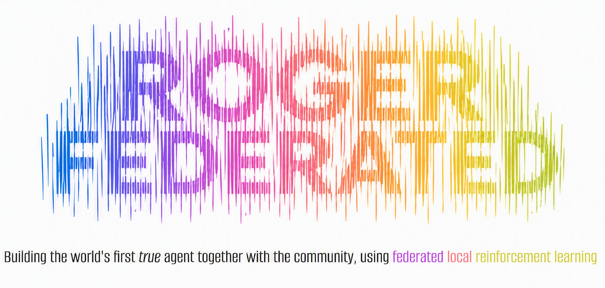

## Overview
A dichotomy in the AI transition is surfacing: Will we continue [to delegate our decisional capacity to closed source models we cannot inspect nor steer](https://blog.mozilla.org/en/mozilla/mozilla-open-source-ai-strategy/) and thus rely on [far-fetched financial projections](https://futurumgroup.com/insights/ai-capex-2026-the-690b-infrastructure-sprint/), or can we do better with [tiny models running on consumer hardware](https://newsletter.semianalysis.com/p/google-we-have-no-moat-and-neither)? *The answer is yes, we can do better.* And that's where Roger Federated comes in.

You and the community can now contribute to the next generation of AI. Not just an LLM with tools, but a purpose-trained agent that is inherently omni-modal. How? By *locally* finetuning a selected *open-source* foundation model on *agentic rollout data*, and subsequently *aggregating* the resulting encrypted model updates (not the data itself) securely with your selected *federations*.


## Features
On top of the basic agentic capabilities listed further [below](#progress--contributing), Roger adds the following.

- **Federated learning using SMPC**: Based on secure multi-party computing, only encrypted weight updates are contributed to your chosen federations. No peer or server can decipher the update and no raw data is ever shared. The aggregated global update is folded back into your base model at load.
- **Efficient local reinforcement learning**: Inference and finetuning run entirely on the user's own machine; raw data never leaves it. QLoRA REINFORCE++ makes on-device RL efficient on consumer GPUs.
- **Privacy filter**: Before any gradient is computed, a train-time anonymiser swaps personally identifiable information for consistent surrogates, so personal data can neither be learned nor transmitted.
- **Self-evaluation rewards**: Rollouts are scored from implicit user signals, verifiable signals, and the model's own self-evaluation.
- **Scales to world models**: The same text-native, RL-safe interface extends from agency to world-models, which the federation can train collaboratively and deploy more cheaply than alternative centralized efforts.
- **More than just software**: Federations, continuous model updating, and an exchange of community-trained adapters on top of basic MCP-driven agentic software make Roger a unique ecosystem that improves as more people contribute.


## Installation

First, download the repo and navigate to the folder. For Windows users: install under WSL2 to use Flash Attention 2 and get the best performance.

```bash
git clone https://github.com/roger-federated/roger-federated.git # or extract from https://github.com/roger-federated/roger-federated/archive/refs/heads/main.zip
cd roger-federated
```

Note:

- Compatible GPU strongly recommended for quantization and speed.
- First run downloads the selected model (several GB) and writes settings under `~/.roger/config.json`. These can be changed at any time.

**Recommended method:**

Additionally requires [`uv`](https://docs.astral.sh/uv/getting-started/installation/) to be installed (provisions Python and isolates dependencies).

```bash
uv tool install . --torch-backend auto   # installs `roger` globally; auto-picks CUDA/CPU torch
# or run without installing:
uvx --from . --torch-backend auto roger
```

<details>
<summary>Platform-dependent caveats</summary>

- `bitsandbytes` (4/8-bit quantization) is installed automatically only where PyPI ships a wheel: x86-64 Linux and Windows. On other CUDA platforms (e.g. aarch64 Jetson/GH200) install a custom wheel manually, e.g. `pip install --force-reinstall https://github.com/bitsandbytes-foundation/bitsandbytes/releases/download/continuous-release_main/bitsandbytes-1.33.7.preview-py3-none-manylinux_2_24_aarch64.whl`.

- Apple Silicon: GPU (MPS/Metal) is not used yet — only the CUDA path is wired up, so macOS runs unquantized on CPU. PRs adding an MPS check alongside the CUDA check in `src/roger/loading/model_setup.py` are welcome.
</details>

**Run:**

After installing, run `roger` from any terminal. First launch walks you through initial setup. Settings (including the model selection) can subsequently be adjusted in `~/.roger/config.json`.

Any config key can be overridden for a single run with a flag, e.g. `roger --model <hf-id> --max-steps 20 --verbose`. To persist a setting, edit the config file. The default federation server currently only accepts Gemma-4 models, so to partake in gradient contribution you must stay on a Gemma-4 base. The smaller `E2B`/`E4B` variants perform significantly worse than the recommended default 12B model, so use them only for low-VRAM experimentation.

For self-improvement purposes, it is of paramount importance that you end a session using Ctrl+D. This will nudge the model to write its memory, and to evaluate its performance.

<details>
<summary>Remote execution on a trusted machine over SSH</summary>

Roger installs and runs identically on any machine you can SSH into, so a rented GPU instance works exactly like your local one. We use Scaleway, but any provider works the same way, e.g. Hetzner, Koyeb, Stackit.

- Rent a GPU instance from a provider offering on-demand GPU compute.
- *Important*: Attach block storage that survives instance deletion, in order to persist the state that lives under `~/.roger/`. Alternatively, you could reverse-tunnel and symlink so that the state is mounted to your local machine.
- On the remote, install the same way, by cloning the repo and running `uv tool install . --torch-backend auto`.
- Optionally run from `tmux` so the session survives an SSH disconnect.

</details>

**MCP servers:**

It is strongly recommended to introduce additional functionalities and tools to Roger by extending the list of MCP services in `~/.roger/mcp.json`. This file uses the standard `mcpServers`-format, and the exact schema can therefore be found at your MCP server's provider.

<details>
<summary>Popular servers to get started</summary>

Drop any of the entries below or others into `~/.roger/mcp.json` and restart Roger. Replace any `<token>`/`<api-key>` placeholder with your own credential, attained from the respective MCP server. Make sure npx is installed for some of these. Additionally, some stdio servers need a one-off install first. Notice that the `_comment` field is ignored. P.S.: if on a remote machine OAuth is required, instead of adding a SSH port forward, it is easier to omit `mcp-remote` wrapper and (e.g., in the case of Canva) replace it with `"canva": { "url": "https://mcp.canva.com/mcp", "oauth": {} }`.

```json
{
  "mcpServers": {
    "github": {
      "_comment": "Repos, issues, PRs, code search; create a fine-grained PAT for the token",
      "type": "http",
      "url": "https://api.githubcopilot.com/mcp/",
      "headers": {"Authorization": "Bearer <token>"}
    },
    "context7": {
      "_comment": "Up-to-date, version-correct docs and snippets for any library; free <api-key> at context7.com raises rate limits",
      "type": "http",
      "url": "https://mcp.context7.com/mcp",
      "headers": {"CONTEXT7_API_KEY": "<api-key>"}
    },
    "gmail": {
      "_comment": "Read and send Gmail; OAuth token obtained via Google Cloud Console",
      "type": "http",
      "url": "https://gmailmcp.googleapis.com/mcp/v1",
      "headers": {"Authorization": "Bearer <oauth-token>"}
    },
    "markitdown": {
      "_comment": "Convert PDFs, Office docs, images and URLs to markdown",
      "command": "uvx",
      "args": ["markitdown-mcp"]
    },
    "ms-word": {
      "_comment": "Read/create/edit Word documents; M365 tenant account required",
      "type": "http",
      "url": "https://agent365.svc.cloud.microsoft/agents/tenants/<tenant-id>/servers/mcp_WordServer",
      "headers": {"Authorization": "Bearer <entra-token>"}
    },
    "ms-teams": {
      "_comment": "Teams chats, channels and messages; M365 tenant account required",
      "type": "http",
      "url": "https://agent365.svc.cloud.microsoft/agents/tenants/<tenant-id>/servers/mcp_TeamsServer",
      "headers": {"Authorization": "Bearer <entra-token>"}
    },
    "notion": {
      "_comment": "Search, read and edit your Notion pages and databases; <token> = an internal-integration secret",
      "command": "npx",
      "args": ["-y", "@notionhq/notion-mcp-server"],
      "env": {"NOTION_TOKEN": "<token>"}
    },
    "linear": {
      "_comment": "Create and manage Linear issues, projects and cycles; <token> = a Linear API key",
      "type": "http",
      "url": "https://mcp.linear.app/mcp",
      "headers": {"Authorization": "Bearer <token>"}
    },
    "touchpoint": {
      "_comment": "Interact with your desktop UI",
      "command": "uvx",
      "args": ["--from", "touchpoint-py", "touchpoint-mcp"]
    },
    "sentry": {
      "_comment": "Inspect and triage your Sentry errors and issues",
      "type": "http",
      "url": "https://mcp.sentry.dev/mcp",
      "headers": {"Authorization": "Bearer <token>"}
    },
    "aws": {
      "_comment": "AWS services (EC2, S3, IAM, etc.); requires AWS CLI configured (`aws configure`)",
      "command": "uvx",
      "args": ["mcp-proxy-for-aws@latest", "https://aws-mcp.us-east-1.api.aws/mcp"]
    },
    "azure": {
      "_comment": "Azure Resource Manager — manage and query Azure resources; get token via `az account get-access-token`",
      "type": "http",
      "url": "https://mcp.management.azure.com",
      "headers": {"Authorization": "Bearer <azure-token>"}
    },
    "sql": {
      "_comment": "Natural language SQL queries against any database; requires dotnet + dab CLI + dab-config.json (see aka.ms/sql/mcp)",
      "command": "dab",
      "args": ["start", "--mcp-stdio", "role:anonymous", "--config", "<path-to-dab-config.json>"]
    },
    "telegram": {
      "_comment": "Full Telegram access (80+ tools); first clone https://github.com/chigwell/telegram-mcp and run uv sync",
      "command": "uv",
      "args": ["run", "--project", "<path/to/telegram-mcp>", "main.py"],
      "env": {
        "TELEGRAM_API_ID": "<api-id>",
        "TELEGRAM_API_HASH": "<api-hash>",
        "TELEGRAM_SESSION_STRING": "<session-string>"
      }
    },
    "alpha-vantage": {
      "_comment": "Stock prices, forex, crypto and economic indicators; free key at alphavantage.co",
      "type": "http",
      "url": "https://mcp.alphavantage.co/mcp?apikey=<api-key>"
    },
    "airbnb": {
      "_comment": "Search Airbnb listings and property details; unofficial, no key needed",
      "command": "npx",
      "args": ["-y", "@openbnb/mcp-server-airbnb"]
    },
    "Canva": {
      "_comment": "create simple designs for e.g. social media",
      "type": "stdio",
      "command": "npx",
      "args": [
        "-y",
        "mcp-remote@latest",
        "https://mcp.canva.com/mcp"
      ]
    },
    "zerolib-email": {
      "_comment": "send email. fill in credentials.",
      "command": "uvx",
      "args": ["mcp-email-server@latest", "stdio"],
      "env": {
        "MCP_EMAIL_SERVER_ACCOUNT_NAME": "default",
        "MCP_EMAIL_SERVER_EMAIL_ADDRESS": "you@domain.com",
        "MCP_EMAIL_SERVER_USER_NAME": "you@domain.com",
        "MCP_EMAIL_SERVER_PASSWORD": "<password>",
        "MCP_EMAIL_SERVER_IMAP_HOST": "<host>",
        "MCP_EMAIL_SERVER_IMAP_PORT": "<port>",
        "MCP_EMAIL_SERVER_SMTP_HOST": "<host>",
        "MCP_EMAIL_SERVER_SMTP_PORT": "<port>",
      }
    },
    "twitter-mcp": {
      "command": "npx",
      "args": ["-y", "@enescinar/twitter-mcp"],
      "env": {
        "API_KEY": "your_api_key_here",
        "API_SECRET_KEY": "your_api_secret_key_here",
        "ACCESS_TOKEN": "your_access_token_here",
        "ACCESS_TOKEN_SECRET": "your_access_token_secret_here"
      }
    }
  }
}
```
</details>


## Use cases
Roger has the potential to perform any digital task. In other words, there is no limit to what you can do with (or delegate to) Roger. Here is a severely non-exhaustive list of examples.

<details>
<summary>Set up a native agent loop for a 24/7 unsupervised e-marketeer</summary>

[](https://youtu.be/8RU9dV9tiLc)

</details>

<details>
<summary>Use always-on mode (with Touchpoint MCP) for assistance in e.g. music production</summary>
...
</details>

<details>
<summary>Automate any MS Office-based task</summary>
...
</details>

<details>
<summary>Develop e.g. a Steam game fully autonomously as a coding agent</summary>
...
</details>


## Pricing

- **Individual**: Free. No strings attached.
- **Leechers**: Free for now. Per-pull charges may apply in the future.
- **Enterprise**: Free for now. In the future, pulling model-update may require a license depending on company size.


## Progress & contributing
The ecosystem is still in development. Below is a non-exhaustive list of to-do items. Of course, we are an open-source community, so **feel free to open an issue or pull request!**

- [x] Investigate framework and open-source models.
- [x] Set up automatic model loading.
- [x] Write code to handle and record agentic rollouts using HF models.
- [x] Give the model agency, i.e., integrate tool use, reasoning, etc., with the LLM as foundation.
- [x] Enable connecting to MCP servers.
- [x] Implement standard tools (e.g., run_command, write_file, prompt_user).
- [x] Replace tool searcher with catalog+load_tools deferred loading (no embedding model needed).
- [x] Implement auto-triggered RAG.
- [x] Allow importing skills and agent.md files.
- [x] Add @path ability.
- [x] Integrate into a CLI application.
- [x] Prettify CLI application.
- [x] Auto read/write memory and create agent folder for temp files.
- [x] Integrate web search and fetch by default.
- [x] Allow resuming conversation after finish.
- [x] <ins>Whoopee, that's a semi-basic agent.</ins>
- [x] Implement what the finetuning framework considers as rewards.
- [x] LLM-as-judge (self-evaluation inspired by RLSR, SRT, Co-rewarding, meta-evaluation; requires a portion of ground truth).
- [x] Implement automatic QLoRA REINFORCE++.
- [x] Use privacy filter for training data.
- [x] Set up gradient contributing and Bonawitz secure aggregation.
- [x] Build the aggregation server: FedAvg, peer-key distribution, aggregate norm-bounding.
- [x] Use DP without accountant until server is busy, then switch to SMPC.
- [x] Launch the default server as a scale-to-zero container on Scaleway with S3 storage.
- [x] Use signatures and tokens (per-registration secret token proves cohort membership at upload).
- [x] <ins>Huzzah, the beta version can now be shipped.</ins>
- [x] Automatic subagent spawning (`spawn_subagent`) with concurrent tool dispatch.
- [x] Native agent loops: `/perpetual` standing tasks with graceful Ctrl-C stop.

Deferred:
- [ ] Zero-knowledge integrity proof to verify scale, mod, keys, clip, model fork.
- [ ] Shamir dropout recovery.
- [ ] Sandboxed docker environments.
- [ ] Integrate spoken instructions.
- [ ] Remote control: copy a session code, enter it on our website, continue interacting encrypted through the browser.
- [ ] Always-on mode: always listen, look, and read, and when a keyboard shortcut is entered, automatically infer and continue the user's task using e.g. Touchpoint.
- [ ] Dynalang-style world model for embedded state roll-forward.
- [ ] Centrally coordinated ground-truth gradient injection.
- [ ] Automatic git worktrees for parallel subagent isolation.